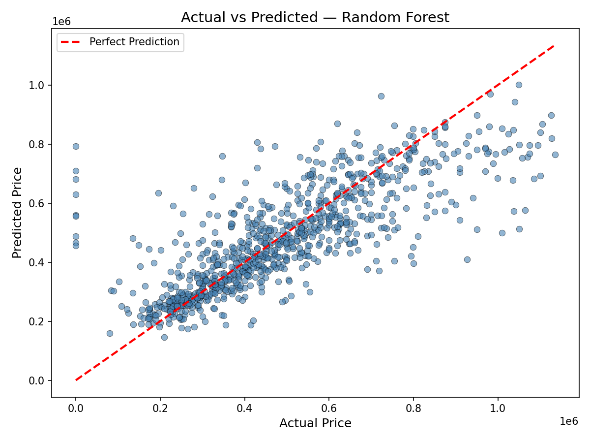
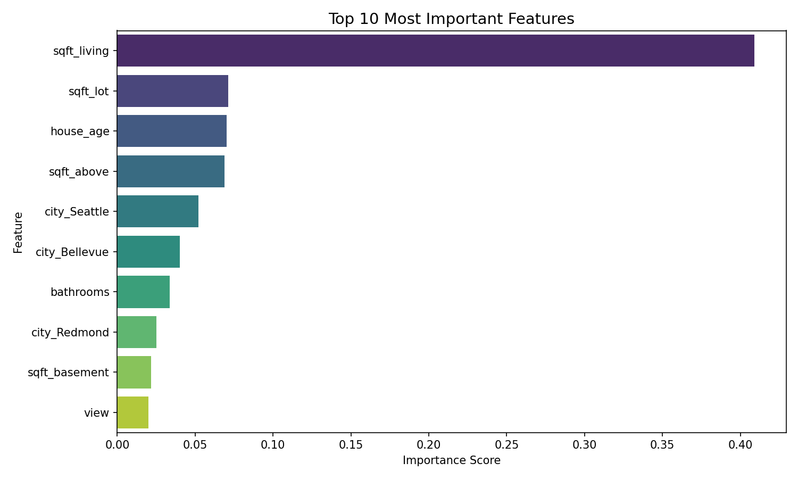
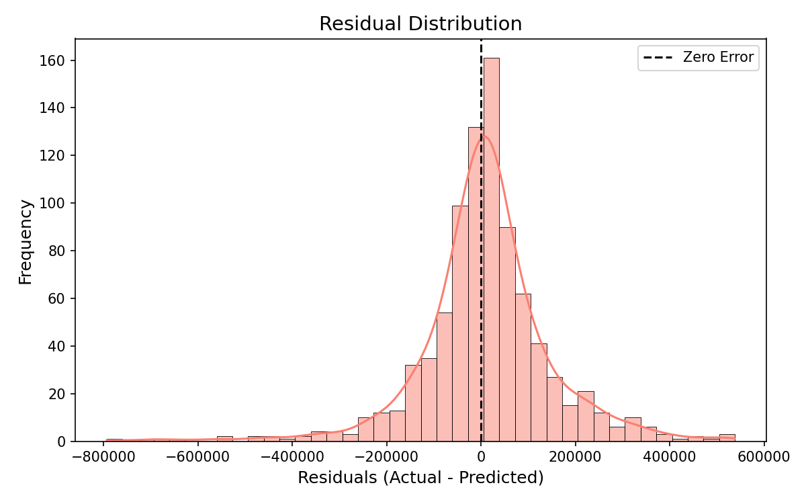

# 🏠 House Price Prediction using Machine Learning

> An end-to-end Machine Learning project that predicts house prices using Linear Regression and Random Forest — with cross-validation, feature engineering, and data visualizations.

---

## 📌 Overview

This project builds a complete ML pipeline to predict house prices based on features like living area, number of bedrooms, bathrooms, location, and more — using a real-world dataset of 4,600 house sales from Washington, USA.

It covers everything from raw data cleaning to model training, evaluation, cross-validation, and visual analysis — structured in a clean, modular codebase.

---

## 🚀 Features

- ✅ Data loading and exploration
- ✅ Missing value handling (median / mode fill)
- ✅ Outlier removal using IQR method
- ✅ Dropping non-informative columns (date, street, statezip, country)
- ✅ Feature Engineering:
  - `yr_built` → `house_age`
  - `yr_renovated` → `renovated` (binary)
- ✅ Categorical encoding (One-Hot Encoding)
- ✅ Feature scaling using StandardScaler
- ✅ Model training:
  - Linear Regression (baseline)
  - Random Forest Regressor ✅ (best performer)
- ✅ **5-Fold Cross Validation** for reliable scoring
- ✅ Automatic best model selection
- ✅ Model evaluation: R², MAE, RMSE
- ✅ 3 Visualizations saved to `/graphs`
- ✅ Model saved with Joblib for reuse
- ✅ Single and batch prediction support

---

## 🧠 Tech Stack

| Tool | Purpose |
|---|---|
| Python 3.x | Core language |
| Pandas | Data manipulation |
| NumPy | Numerical operations |
| Scikit-learn | ML models, scaling, evaluation |
| Matplotlib | Plotting graphs |
| Seaborn | Beautiful visualizations |
| Joblib | Model saving & loading |

---

## 📂 Project Structure

```
House-Price-Prediction/
│
├── data/
│   └── data.csv                  # Kaggle House Sales dataset (Washington, USA)
│
├── src/
│   ├── __init__.py
│   ├── preprocess.py             # Cleaning, encoding, feature engineering, scaling
│   ├── train.py                  # Model training, cross-validation, graphs
│   └── predict.py                # Single & batch prediction
│
├── models/
│   ├── model.pkl                 # Saved best model (Random Forest)
│   └── scaler.pkl                # Saved StandardScaler
│
├── graphs/
│   ├── actual_vs_predicted.png   # Graph 1
│   ├── feature_importance.png    # Graph 2
│   └── residuals.png             # Graph 3
│
├── notebooks/
│   └── eda.ipynb                 # Exploratory Data Analysis
│
├── main.py                       # Entry point — run this
├── requirements.txt
└── README.md
```

---

## ⚙️ How It Works

```
Raw CSV → Clean → Feature Engineering → Encode → Scale → Train → Evaluate → Predict
```

1. **Load** the dataset from `data/data.csv`
2. **Clean** — fill missing values, remove outliers
3. **Drop** useless columns (date, street, statezip, country)
4. **Engineer** new features (house_age, renovated)
5. **Encode** categorical features (city) using One-Hot Encoding
6. **Scale** features with StandardScaler
7. **Train** Linear Regression and Random Forest
8. **Cross-validate** using 5-Fold CV for reliable R² scores
9. **Auto-select** the best performing model
10. **Save** model + scaler to `models/`
11. **Plot** 3 graphs and save to `graphs/`

---

## 📊 Model Performance

| Model | Test R² | CV Mean R² | CV Std Dev | MAE | RMSE |
|---|---|---|---|---|---|
| Linear Regression | 0.5925 | 0.5604 | 0.2358 | $94,424 | $142,088 |
| **Random Forest ✅** | **0.6086** | **0.5983** | **0.1648** | **$92,847** | **$139,266** |

> Random Forest was automatically selected as the best model based on Test R².  
> Dataset: 4,600 house sales from Washington, USA (Kaggle). 240 outliers removed via IQR.

---

## 📈 Visualizations

### 1. Actual vs Predicted Prices
Points close to the red dashed line = accurate predictions.



---

### 2. Feature Importance
Shows which features influence house price the most (Random Forest).



---

### 3. Residual Distribution
A bell curve centered near 0 means the model errors are balanced.



---

## ▶️ How to Run

### 1. Clone the repository
```bash
git clone https://github.com/Atharva110409/House-price-prediction.git
cd House-price-prediction
```

### 2. Install dependencies
```bash
pip install -r requirements.txt
```

### 3. Run the pipeline
```bash
python main.py
```

This will:
- Preprocess the data and engineer features
- Train both models with 5-fold cross-validation
- Print R², MAE, RMSE in the terminal
- Save graphs to `graphs/`
- Save the best model to `models/`

---

## 🔮 Making Predictions

**Single prediction:**
```python
from src.predict import predict

# Feature values in training column order
predicted_price = predict([2000, 3, 2, 2, 0, 1, 800, 0, 1200, 3, 0, 70, 1])
print(predicted_price)
```

**Batch prediction:**
```python
import pandas as pd
from src.predict import predict_batch

df = pd.read_csv("new_houses.csv")
prices = predict_batch(df)
print(prices)
```

---

## 🔁 Cross Validation Output

```
[INFO] Running 5-Fold Cross Validation for Random Forest...
  CV R² Scores : [0.6966, 0.6521, 0.6982, 0.674, 0.2705]
  Mean R²      : 0.5983
  Std Dev      : 0.1648
```

The lower score on fold 5 suggests some geographic variation in the city-encoded data — a good candidate for future improvement with better location features.

---

## 📦 Requirements

```
pandas
numpy
scikit-learn
matplotlib
seaborn
joblib
```

Install all with:
```bash
pip install -r requirements.txt
```

---

## 🔮 Future Improvements

- [ ] Hyperparameter tuning with GridSearchCV
- [ ] Try XGBoost / LightGBM for better accuracy
- [ ] Better location features (lat/long clustering)
- [ ] Streamlit web app for interactive predictions
- [ ] Deploy to Render or HuggingFace Spaces

---

## 💡 What I Learned

- End-to-end machine learning workflow on a real dataset
- Why cross-validation gives more reliable results than a single train/test split
- How feature engineering (house_age, renovated) improves model quality
- How to identify and drop non-informative columns
- Reading feature importance to understand what drives house prices
- Writing modular, clean Python code for ML projects

---

## 🤝 Contributing

Feel free to fork this repo, raise issues, or submit pull requests. All contributions are welcome!

---

## ⭐ If you found this useful

Give it a star ⭐ on GitHub — it helps a lot!
